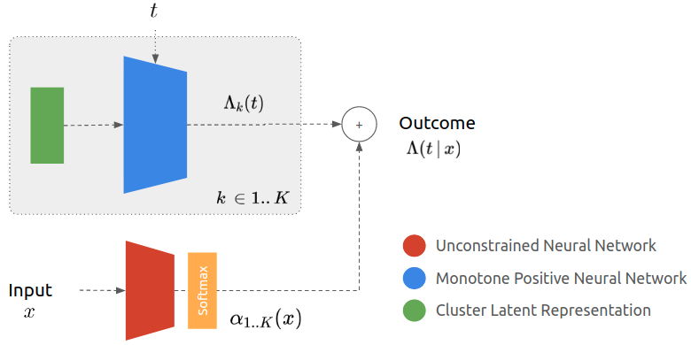

# Neural Survival Cluster
This repository allows to reproduce the results in [Neural Survival Clustering: Non parametric mixture of neural networks for survival clustering]()
This paper approaches survival analysis as a mixture of neural baselines whereby different baseline cumulative hazard functions are modelled using positive and monotone neural networks.

## Model
The model consists in a mixture of K neural networks that model different population-level survival distributions, and an assignment neural network that weights these different mixtures given the input data. 



## How to use the model ?
To use the model, one needs to execute:
```python
from nsc import NeuralSurvivalClustering
model = NeuralSurvivalClustering()
model.fit(x, t, e)
model.predict_risk(x)
```

A full example with analysis is provided in `examples/Neural Survival Clustering on SUPPORT Dataset.ipynb`.

## Reproduce paper's results
To reproduce the paper's results:

0. Clone the repository with dependencies: `git clone git@github.com:Jeanselme/NeuralSurvivalClustering.git --recursive`
1. Create a conda environment with all necessary libraries `pycox`, `lifelines`, `pysurvival`.
2. Add path `export PYTHONPATH="$PWD:$PWD/DeepSurvivalMachines:$PYTHONPATH"`
3. Run `examples/experiments_paper.py METABRIC`
4. Repeat with `SUPPORT` and `SYNTHETIC`
5. Analysis using `examples/Analysis.ipynb`

## Compare to a new method
Adding a new method consists in adding a child to `Experiment` in `experiment.py` with functions to compute the nll and fit the model.
Then, add the method in `examples/experiments_paper.py` and follow the previous point. 
`TODOs` have been added to make the addition of a new method easier.

## Future directions
- Competing risks.
- Post analysis: Replacing assignment neural network by more interpretable approach.

# Setup
## Structure
We followed the same structure than the [DeepSurvivalMachines](https://github.com/autonlab/DeepSurvivalMachines) repository with the model in `nsc/` - only the api should be used to test the model. Examples are provided in `examples/`. 

## Clone
```
git clone git@github.com:Jeanselme/NeuralSurvivalClustering.git --recursive
```

## Requirements
The model relies on `DeepSurvivalMachines`, `pytorch`, `numpy` and `tqdm`.  
To run the set of experiments `pycox`, `lifelines`, `pysurvival` are necessary.